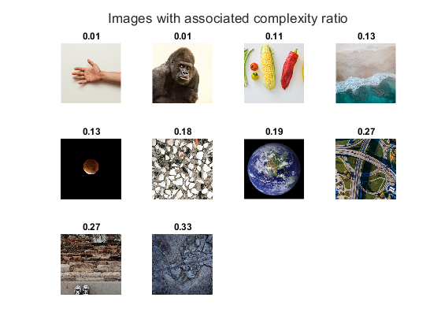
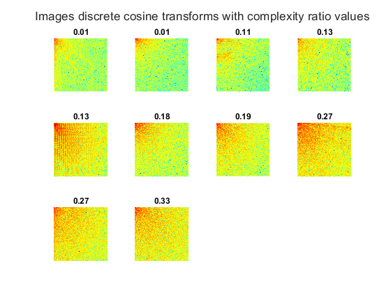

### License


<sup><sub> Please cite the following publication when using or adapting this software or substantial portion thereof for work resulting a publication (also see the CITATION file) :<br/>Rose O., Johnson J.K., Wang B. and Ponce C.R.; As simple as possible, but not simpler: features of the neural code for object recognition; JOURNAL TBA<br/><br/>MIT License<br/>Copyright (c) 2021 PonceLab<br/>Permission is hereby granted, free of charge, to any person obtaining a copy of this software and associated documentation files (the "Software"), to deal in the Software without restriction, including without limitation the rights to use, copy, modify, merge, publish, distribute, sublicense, and/or sell copies of the Software, and to permit persons to whom the Software is furnished to do so, subject to the following conditions:<br/>The above copyright notice and this permission notice shall be included in all copies or substantial portions of the Software.<br/>THE SOFTWARE IS PROVIDED "AS IS", WITHOUT WARRANTY OF ANY KIND, EXPRESS OR IMPLIED, INCLUDING BUT NOT LIMITED TO THE WARRANTIES OF MERCHANTABILITY, FITNESS FOR A PARTICULAR PURPOSE AND NONINFRINGEMENT. IN NO EVENT SHALL THE AUTHORS OR COPYRIGHT HOLDERS BE LIABLE FOR ANY CLAIM, DAMAGES OR OTHER LIABILITY, WHETHER IN AN ACTION OF CONTRACT, TORT OR OTHERWISE, ARISING FROM, OUT OF OR IN CONNECTION WITH THE SOFTWARE OR THE USE OR OTHER DEALINGS IN THE SOFTWARE. </sup></sub>


```Matlab
% add the necessary files to the path (this should be all that is required)
addpath(genpath(pwd))
addpath(genpath(fullfile(fileparts(pwd),'data')))
addpath(genpath(fullfile(fileparts(pwd),'utils')))
```

# Complexity analysis.


In this live script, the goal is to illustrate how we computed "complexity ratio" values for every image. In the paper, we defined this complexity ratio using discrete cosine transforms (DCTs). This transforms a given RGB image into a set of coefficients, corresponding to cosine component functions with different frequencies. By keeping the fewest components (i.e., fewest non-zero coefficients) necessary to reconstruct the image, the image is compressed. The reconstruction complexity of an image can be measured as the ratio of the minimum number of components needed to reconstruct the image divided by the total original number of components . This inverse of the *compression ratio* provides a measure of image complexity, and so we call it a *complexity ratio*.


  
# Load example images


First, we load up images using imageDatastore. These images were downloaded from pexels.org and can be used/published under Fair Use.


```Matlab
testImStack = [] ;
myDS = imageDatastore('..\data\natural-image-examples');
pics = readall(myDS);
for iPic = 1:length(pics)
    tPic = pics{iPic};
    pic_size = size(tPic);

    win1 = centerCropWindow2d(pic_size,[min(size(tPic,1:2)) min(size(tPic,1:2))]);
    img = imcrop(tPic,win1);
    img = imresize(img,[256 256]) ;
    testImStack = cat(4,testImStack,img);
end % of iPic
figure
montage(testImStack)
title('Example images')
```


```Matlab

```

  
# Calculate complexity ratio values per image


The complexity ratio is the inverse of the compression ratio. The image is first decomposed in to the components of the discrete cosine transform. This is a real-valued frequency based transform such that the square of the components indicate the energy in each frequency component. The complexity ratio is the ratio of the number of components needed to reconstruct the image to a given fidelity, divided by the total number of components. The amount of energy in a component is a proxy for how much variation in the image is embedded in that component. Thus to reconstruct an image to X% accuracy, you need components that capture X% of the total energy. The more components you need to keep to capture X% of the energy, the more complex the image. Here we compute the average complexity ratio for 99.8% through 50% of the total energy. 


```Matlab
frac_all = 1 - 2.^(-9:-1) ; % fractions here are 99.8% to 50%.
dcStacks = nan([size(testImStack,[1 2]) 1, size(testImStack,4)]) ;
cRatio_examples = nan(size(testImStack,4),numel(frac_all));
% this loop computes the ratio of every image
for iPic = 1:size(testImStack,4)
    [comp_ratio,~,dct] = ...
        Project_CMA_computeCompRatio_aux(testImStack(:,:,:,iPic)) ;
    % ratio per image per fraction
    cRatio_examples(iPic,:) = comp_ratio;
    % dct per image
    dcStacks(:,:,:,iPic) = log(abs(dct));
end % of iPic

% mean value across fractions
mean_cRatio_example = mean(cRatio_examples,2) ;

figMain = figure ;
figDCT = figure;

% show every image sorted by its ratio
[~,iSort] = sort( mean_cRatio_example ,'ascend','MissingPlacement','last') ;

nHighlight = 5;
nss = [2 nHighlight];
S_to_show = [iSort(1:nHighlight); ...
    iSort(length(iSort)-(nHighlight-1):length(iSort)) ] ;

for iShow = 1:(nHighlight*2)
    tInd = S_to_show(iShow) ;

    
    figure(figMain)
    nexttile
    imagesc(testImStack(:,:,:,tInd ) );
    axis image off; colorbar off; box off;
    title(sprintf('%1.2f',mean_cRatio_example( tInd ) ) );
    sgtitle('Images with associated complexity ratio')
    
    
    figure(figDCT)
    nexttile
    imagesc(dcStacks(:,:,:,tInd ) );
    axis image off; colorbar off; box off;
    colormap(gca,jet(64))
    title(sprintf('%1.2f',mean_cRatio_example( tInd ) ) );
    sgtitle('Images discrete cosine transforms with complexity ratio values')
    
end
```







  
# Measuring complexity via Mean-shift 
  


Here, we analyze complexity using a different approach - analyzing segmentation clusters. This analysis relies on code from Alireza (2020). k-means, mean-shift and normalized-cut segmentation (https://www.mathworks.com/matlabcentral/fileexchange/52698-k-means-mean-shift-and-normalized-cut-segmentation)


Reference for mean-shift segmentation: [https://spin.atomicobject.com/2015/05/26/mean-shift-clustering/](https://spin.atomicobject.com/2015/05/26/mean-shift-clustering/)


Segmentation here is defined as  mean-shift clustering, which is based on kernel density estimation and K-means.


  


How this works:


```Matlab

fragCount_all = nan(1,size(testImStack,4));
segmentedPics_all = [] ;

bw = 0.2;
for iPic = 1:size(testImStack,4)

    img_original = testImStack(:,:,:,iPic); % double, 0-1
    img_resized = imresize(img_original,[100 nan]); % resize - too computationally costly otherwise

    % function returns clustered image, num. clusters, and membership of
    % each pixel per cluster
    [Ims2, Nms2, clusterMemb] = Ms2(img_resized,bw);           % Mean Shift (color + spatial)

    clustMembsOld=clusterMemb;
    clustMembsCell=[];
    ndxArray=reshape(1:prod(size(img_resized,[1,2])),size(img_resized,[1,2]));
    
    for segNdx=1:length(clusterMemb)
        segBW=ismember(ndxArray,clustMembsOld{segNdx}); % BW image of one segment
        CC=bwconncomp(segBW); % break that segment into only contiguous pieces
        clustMembsCell=[clustMembsCell,CC.PixelIdxList]; % store the pieces
        clustMembsOld{segNdx}=[]; % save memory
    end
    
    Kms = length(clustMembsCell);
    clusterMemb = clustMembsCell ;

    segmentedPics_all = cat(4,segmentedPics_all,Ims2);
    n_perCluster = cellfun(@numel, clusterMemb ) ;
    
    % count clusters with more than N pixels assigned to them
    n_NoSpurious = sum( n_perCluster > 10 ) ;
    
    fragCount_all(iPic,1:2) =  [Nms2 n_NoSpurious]  ;

end

```


Plot the images and their clustered versions, sorted by number of parts.


```Matlab
[~,iSort] = sort(fragCount_all(:,1),'ascend') ;

fig = figure;

for iPic = 1:size(testImStack,4)

    img = testImStack(:,:,:,iSort(iPic)); % double, 0-1

    nexttile
    imshow(img);
    title(sprintf('image %d',iPic))
    
    nexttile
    imshow(segmentedPics_all(:,:,:,iSort(iPic)));
    title(sprintf('%d parts',...
        fragCount_all(iSort(iPic),1) ) );

end
```


```Matlab

```

# Functions

```Matlab
function [comp_ratio,frac_all,dct] = Project_CMA_computeCompRatio_aux(im,varargin)

if nargin == 1
    frac_all = 1 - 2.^(-9:-1) ;
elseif nargin == 2
    frac_all = varargin{1} ;
end

% define helper functions.
unwrap=@(x) x(:);
applyDCT=@(x) dct2(x-mean(x(:)) ).^2 ; % simple DCT - ALWAYs remove the mean first (as demonstrated here)
compRatio=@(x,frac) find( (cumsum(sort(unwrap(x),'descend'))/sum(unwrap(x)) ) >=frac,1,'first')/numel(x);

if size(im,3) > 1
    im = rgb2gray(im);
end
dct = applyDCT(im);
comp_ratio = nan(1,length(frac_all) );
for iFrac = 1:length(frac_all)
    comp_ratio(1,iFrac) = compRatio(dct,frac_all(iFrac));
end

end
```

