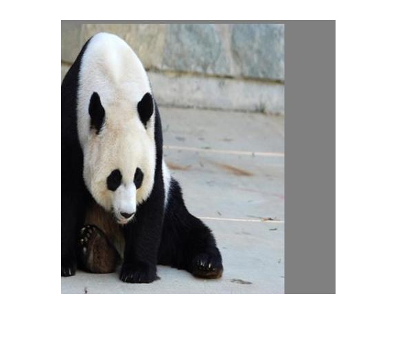
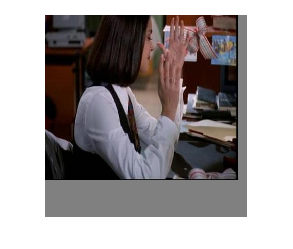
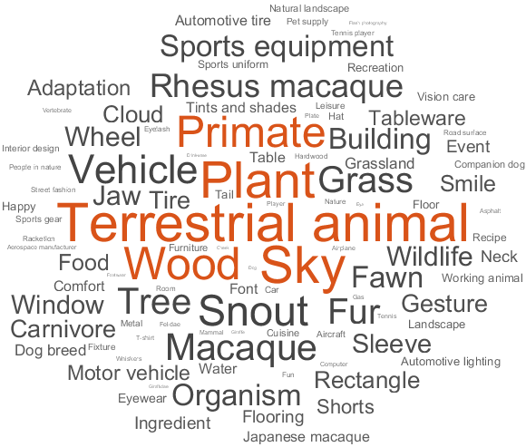

[Link to Part 1: COCO-stuff](https://github.com/PonceLab/as-simple-as-possible/blob/main/Image_Content_Analysis/README.md)
# License


Please cite the following publication when using or adapting this software or substantial portion thereof for work resulting a publication:


Rose O., Johnson J.K., Wang B. and Ponce C.R.; As simple as possible, but not simpler: features of the neural code for object recognition; JOURNAL TBA


(also see the CITATION file)


  


MIT License


Copyright (c) 2021 PonceLab


Permission is hereby granted, free of charge, to any person obtaining a copy of this software and associated documentation files (the "Software"), to deal in the Software without restriction, including without limitation the rights to use, copy, modify, merge, publish, distribute, sublicense, and/or sell copies of the Software, and to permit persons to whom the Software is furnished to do so, subject to the following conditions:


The above copyright notice and this permission notice shall be included in all copies or substantial portions of the Software.


THE SOFTWARE IS PROVIDED "AS IS", WITHOUT WARRANTY OF ANY KIND, EXPRESS OR IMPLIED, INCLUDING BUT NOT LIMITED TO THE WARRANTIES OF MERCHANTABILITY, FITNESS FOR A PARTICULAR PURPOSE AND NONINFRINGEMENT. IN NO EVENT SHALL THE AUTHORS OR COPYRIGHT HOLDERS BE LIABLE FOR ANY CLAIM, DAMAGES OR OTHER LIABILITY, WHETHER IN AN ACTION OF CONTRACT, TORT OR OTHERWISE, ARISING FROM, OUT OF OR IN CONNECTION WITH THE SOFTWARE OR THE USE OR OTHER DEALINGS IN THE SOFTWARE.


  

```matlab:Code
% add the necessary files to the path (this should be all that is required)
addpath(genpath(pwd))
addpath(genpath(fullfile(fileparts(pwd),'data')))
addpath(genpath(fullfile(fileparts(pwd),'utils')))
```

  
# Using Google Cloud Service for Large Scale Image Labelling


This livescript demonstrates accessing the Google Cloud Vision API and interpreting results. With cloud vision one can obtain very precise labels for images and discover whether an impartial judge has found them to contain certain types of content. It allows for qualitative characterization of image content en-masse. 


Link to the [Tutorial in Binxu's Blog](https://animadversio.github.io/tech_note/using-google-cloud-service-for-large-scale-image-labelling). 

[Link to Part 1: COCO-stuff](https://github.com/PonceLab/as-simple-as-possible/blob/main/Image_Content_Analysis/README.md)


# Installing Google SDK


[https://cloud.google.com/sdk/docs/quickstart-windows](https://cloud.google.com/sdk/docs/quickstart-windows)


   1.  New a Google Cloud Platform Project 
   1.  Download [Google Cloud SDK](https://dl.google.com/dl/cloudsdk/channels/rapid/GoogleCloudSDKInstaller.exe?hl=zh-cn) 
   1.  After installation run `gcloud init` and log in to your account there! 
   1.  Select the GCP Project and the computing zone 
   1.  Finish the SDK configuration! 

# Installing Google API for different programs (like Vision we use)


[https://cloud.google.com/python/](https://cloud.google.com/python/)


[https://googleapis.github.io/google-cloud-python/latest/vision/index.html](https://googleapis.github.io/google-cloud-python/latest/vision/index.html)


```matlab:Code(Display)
conda install -c conda-forge google-cloud-vision
```


Following packages may be necassary


```matlab:Code(Display)
conda install -c conda-forge google-api-python-client
conda install -c conda-forge google-auth
conda install -c conda-forge google-auth-oauthlib
```

# Set up Credentials for Google on PC


[https://cloud.google.com/docs/authentication/getting-started](https://cloud.google.com/docs/authentication/getting-started)


   1.  Follow the steps to get an account and a credential. Download the JSON file it generates 
   1.  `export` or set the environment variables manually 
   1.  `set GOOGLE_APPLICATION_CREDENTIALS=[path_to_json]` 


*Note*: If this is not set, then you can import the google packages like `from google.cloud import vision`. But you will see errors when creating a client!


[https://cloud.google.com/docs/authentication/production\#obtaining_and_providing_service_account_credentials_manually](https://cloud.google.com/docs/authentication/production#obtaining_and_providing_service_account_credentials_manually)


*Note*: If the environment variable is not working, manually set it in python.


```matlab:Code(Display)
import os
import io
import json
import pickle
from os.path import join
os.environ['GOOGLE_APPLICATION_CREDENTIALS'] = r"D:\Github\Google_Vision_Image_Labelling\Image-patch-labelling-4e4cfd1664c2.json"
from google.cloud import vision
# Get the client! 
client = vision.ImageAnnotatorClient()

imgbasedir = r"N:\Stimuli\2019-Free-Viewing"
subfolders = ['2019-08-19-Beto',]
# if you want to try on a few examples use the following 2 lines
# imgbasedir = r"data" 
# subfolders = ["cloud_vision_demo",]

for subfolder in subfolders:
    imgdir = join(imgbasedir, subfolder)
    imgnames = [fn for fn in os.listdir(imgdir) if \
                any(fn.endswith('.'+sfx) for sfx in ["bmp","BMP","jpg","jpeg","png","JPG","JPEG","tiff","TIFF"]) and \
                not os.path.isdir(join(imgdir, fn))]
    print("%d Images in %s folder" % (len(imgnames), subfolder))

#%%
from time import time
t0 = time()
for subfolder in subfolders:
    imgdir = join(imgbasedir, subfolder)
    # filter image names by their suffix
    imgnames = [fn for fn in os.listdir(imgdir) if \
                any(fn.endswith('.'+sfx) for sfx in ["bmp","BMP","jpg","jpeg","png","JPG","JPEG","tiff","TIFF"]) and \
                not os.path.isdir(join(imgdir, fn))]
    print("%d Images in %s folder" % (len(imgnames), subfolder))

    image_parse_dict = {}
    for imgname in imgnames:
        with io.open(join(imgdir, imgname), 'rb') as image_file:
            content = image_file.read()
        print(imgname)
        image = vision.types.Image(content=content)

        response = client.label_detection(image=image)
        labels = response.label_annotations
        print('Labels:')

        label_data = []
        for label in labels:
            print("%s score: %.4f " % (label.description, label.score))
            label_data.append((label.description, label.score))
        print("\n")
        image_parse_dict[imgname] = label_data

    pickle.dump(image_parse_dict, open(join(imgdir, "label_dict.pkl"), "wb")) # Pkl file saved in binary format
    json.dump(image_parse_dict, open(join(imgdir, 'label_result.json'), 'w')) # json file saved in readable format
    print("%.1fs" % (time() - t0))
    # JSON is easier for matlab to read!!
    # do `jsonData = jsondecode(fileread('..\\label_result.json'));` in matlab

print("%.1fs" % (time() - t0))
#%% Loading code
image_parse_dict = pickle.load(open(os.path.join(imgdir, "label_dict.pkl"), "rb"))
data_dict = json.load(open('result.json', 'r'))
```

  


After you run the code, you will see output like the following 


```matlab:Code(Display)
401 Images in 2019-08-19-Beto folder
52.jpg
Labels:
Primate score: 0.9569 
Jaw score: 0.8779 
Rhesus macaque score: 0.8694 
Organism score: 0.8639 
Gesture score: 0.8448 
Macaque score: 0.8229 
Adaptation score: 0.7937 
Terrestrial animal score: 0.7637 
Snout score: 0.7554 
Photo caption score: 0.7109 

COCO_train2014_000000236279.jpg
Labels:
Food score: 0.9810 
Tableware score: 0.9318 
Ingredient score: 0.8862 
Recipe score: 0.8681 
Fines herbes score: 0.8628 
Lemon score: 0.8482 
Plate score: 0.8439 
Leaf vegetable score: 0.8363 
Sweet lemon score: 0.8346 
Garnish score: 0.8045 

.....
```


Here it takes 99 secs to process 405 images. 


# Post Processing 


Next we read the json file in matlab and do some quick analysis, here we put the result json file in the `data\cloud_vision_demo `folder. First convert the `json` file to a more matlab-friendly data structure. 


```matlab:Code
cd D:\Poncelab_Github\as-simple-as-possible
imgdir = ".\data\cloud_vision_demo"
```


```text:Output
imgdir = ".\data\cloud_vision_demo"
```


```matlab:Code
[img2labelmap, imgnms, labels] = parsejson(".\data\cloud_vision_demo\label_result.json");
```


Let's see some examples images and labels.


```matlab:Code
imshow(fullfile(imgdir,"n01494475_17826.JPEG"))
```





```matlab:Code
struct2table(img2labelmap("n01494475_17826.JPEG"))
```

| |labels|scores|
|:--:|:--:|:--:|
|1|"Panda"|0.9668|
|2|"Organism"|0.8587|
|3|"Carnivore"|0.8030|
|4|"Terrestrial animal"|0.7656|
|5|"Natural material"|0.7621|
|6|"Fur"|0.6162|
|7|"Balance"|0.5421|
|8|"Foot"|0.5167|
|9|"Zoo"|0.5008|


```matlab:Code

imshow(fullfile(imgdir,"COCO_train2014_000000003008.jpg"))
```





```matlab:Code
struct2table(img2labelmap("COCO_train2014_000000003008.jpg"))
```

| |labels|scores|
|:--:|:--:|:--:|
|1|"Hand"|0.9569|
|2|"Eyelash"|0.8941|
|3|"Gesture"|0.8526|
|4|"Event"|0.7118|
|5|"Science"|0.6979|
|6|"Job"|0.6358|
|7|"Home appliance"|0.6342|
|8|"Television"|0.6326|
|9|"Room"|0.6086|
|10|"Sitting"|0.5871|


Here is the wordcloud of all labels for this batch of images. 


```matlab:Code
labels_all = cat(1,labels.labels);
wordcloud(categorical(labels_all))
```





[Link to Part 1: COCO-stuff](https://github.com/PonceLab/as-simple-as-possible/blob/main/Image_Content_Analysis/README.md)


```matlab:Code
function [img2labelmap, imgnms, labelarr] = parsejson(json_path)
py.importlib.import_module("json");
jsondata = py.json.load(py.open(json_path,"r"));
imgnms = cellfun(@(X)X.string,cell(py.list(jsondata.keys())));
results = cell(py.list(jsondata.values()));

img2labelmap = containers.Map();
labelarr = [];
for i = 1:numel(results)
S = struct();
S.labels = cellfun(@(A)A{1}.string,cell(results{i}))';
S.scores = cellfun(@(A)A{2},cell(results{i}))';
img2labelmap(imgnms(i)) = S;
labelarr = [labelarr;S];
end
% jsonData = jsondecode(fileread(json_path));
return 
end
```

