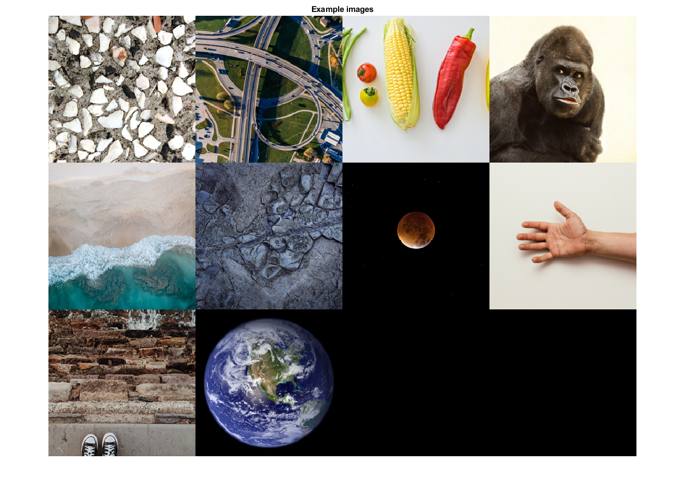
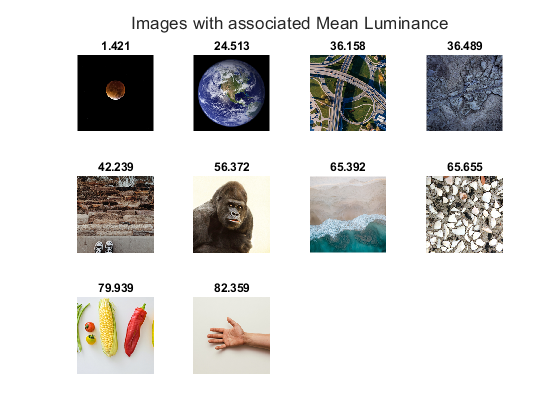
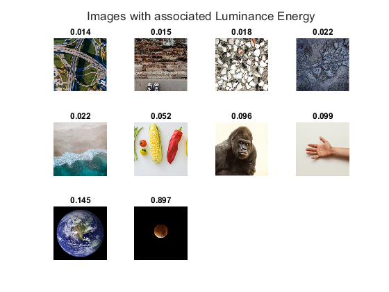
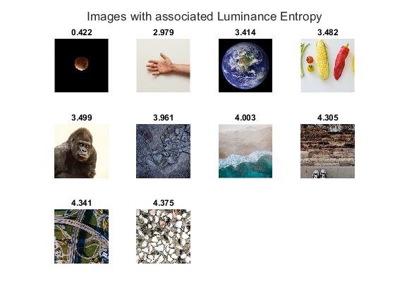
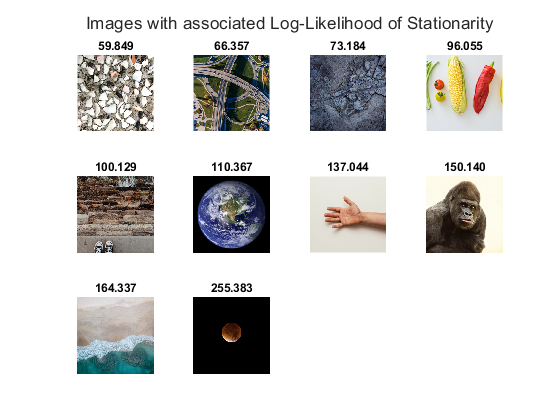
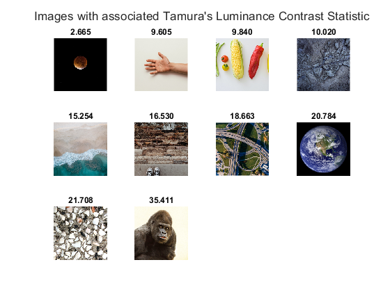
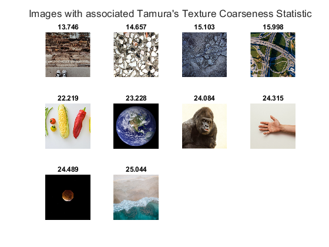
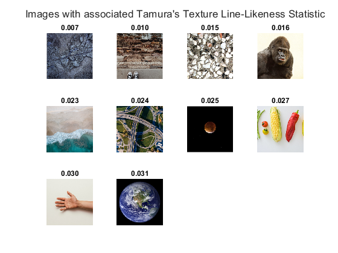
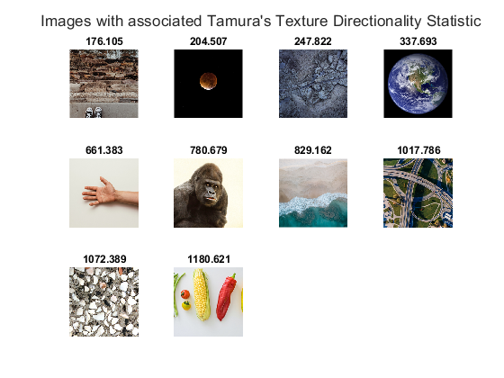

### License


<sup><sub> Please cite the following publication when using or adapting this software or substantial portion thereof for work resulting a publication (also see the CITATION file) :<br/>Rose O., Johnson J.K., Wang B. and Ponce C.R.; Visual prototypes in the ventral stream are attuned to complexity and gaze behaviour; Nat. Commun; 2021<br/><br/>MIT License<br/>Copyright (c) 2021 PonceLab<br/>Permission is hereby granted, free of charge, to any person obtaining a copy of this software and associated documentation files (the "Software"), to deal in the Software without restriction, including without limitation the rights to use, copy, modify, merge, publish, distribute, sublicense, and/or sell copies of the Software, and to permit persons to whom the Software is furnished to do so, subject to the following conditions:<br/>The above copyright notice and this permission notice shall be included in all copies or substantial portions of the Software.<br/>THE SOFTWARE IS PROVIDED "AS IS", WITHOUT WARRANTY OF ANY KIND, EXPRESS OR IMPLIED, INCLUDING BUT NOT LIMITED TO THE WARRANTIES OF MERCHANTABILITY, FITNESS FOR A PARTICULAR PURPOSE AND NONINFRINGEMENT. IN NO EVENT SHALL THE AUTHORS OR COPYRIGHT HOLDERS BE LIABLE FOR ANY CLAIM, DAMAGES OR OTHER LIABILITY, WHETHER IN AN ACTION OF CONTRACT, TORT OR OTHERWISE, ARISING FROM, OUT OF OR IN CONNECTION WITH THE SOFTWARE OR THE USE OR OTHER DEALINGS IN THE SOFTWARE. </sup></sub>


```Matlab
% add the necessary files to the path (this should be all that is required)
addpath(genpath(pwd))
addpath(genpath(fullfile(fileparts(pwd),'data')))
addpath(genpath(fullfile(fileparts(pwd),'utils')))
```

  
# Image Statistic Analysis


This livescript demonstrates the use of image statistics found in the paper. In particular these statistics were used to establish that salient and random patches from real images differ strongly according to statistics poorly related to semantic categorization of image content, but that our random surrogates (shuffled prototypes) do a better job of preserving these statistics.


# Load example images


First, we load up images using imageDatastore. These images were downloaded from pexels.org and can be used/published under Fair Use.


```Matlab
testImStack = [] ;
lumImStack = [] ;
myDS = imageDatastore('..\data\natural-image-examples');
pics = readall(myDS);
for iPic = 1:length(pics)
    tPic = pics{iPic};
    pic_size = size(tPic);

    win1 = centerCropWindow2d(pic_size,[min(size(tPic,1:2)) min(size(tPic,1:2))]);
    img = imcrop(tPic,win1);
    img = imresize(img,[256 256]) ;
    testImStack = cat(4,testImStack,img);
    img=rgb2lab(img);
    lumImStack = cat(4,lumImStack,img(:,:,1));
end % of iPic
figure
montage(testImStack)
title('Example images')
```




  
# Mean Luminance


The CIE 1976 L*a*b*  includes a physiological luminance channel, analogous to grey scale images. The mean luminance of images is an important statistic to consider as the image content is recognizable across a wide range of luminance, but the neural responses may differ strongly. 


```Matlab
statName='Mean Luminance';
statVec=zeros(1,size(testImStack,4));
for imNdx=1:length(statVec)
    statVec(imNdx)=mean(lumImStack(:,:,:,imNdx),'all','omitnan');
end
plotStatisticTiles(testImStack,statVec,statName)
```




  
# Energy


The energy of a distribution is roughly it's "peakiness". It denotes the absence of texture. It is the sum of squares of the probability for each discrete pixel value. When only a few pixel values are occupied the energy is high. Thus linedrawings and "posterized" images have high energy. Energy is counterposed with entropy. This function gets both entropy and energy and is configured only for the luminance channel. 


```Matlab
statName='Luminance Energy';
statVec=zeros(2,size(testImStack,4));
for imNdx=1:length(statVec)
    [statVec(1,imNdx),statVec(2,imNdx)]=getImEnergyEntropy(lumImStack(:,:,:,imNdx));
end
plotStatisticTiles(testImStack,statVec(1,:),statName)
```




  
# Entropy


Entropy is the information density of the image, sometimes labeled as a measure of randomness. It denotes the presence of texture. It is the sum of the product of the probability for each discrete pixel value and the natural logarithm of the same. Images with all pixel values in equal proportions have high entropy. Richly textured images that are also high in contrast have high entropy. Entropy was calculated above but plotted here. 


```Matlab
statName='Luminance Entropy';
plotStatisticTiles(testImStack,statVec(2,:),statName)
```




  
# Log-Likelihood of a Stationary model


The stationarity of an image is a measure of wether all parts of the image have similar textures. Images with few objects and fine textures have high stationarity. Images with coarse textures or many dissimilar objects have low stationarity. Stationarity is calculated by summing (integrating) the pixels along lines extending from several image locations. If an image is stationary the integral as a function of distance F(d) would show symmetric noise about a linearly increasing ramp function. The stationarity of an image is the sum of the negative logarithms of the probabilities of the true F(d) under an gaussian distribution about the ramp function. 


```Matlab
statName='Log-Likelihood of Stationarity';
statVec=zeros(1,size(testImStack,4));
for imNdx=1:length(statVec)
    statVec(1,imNdx)=stationarityOfImageStat(lumImStack(:,:,:,imNdx));
end
plotStatisticTiles(testImStack,statVec(1,:),statName)
```




  
# Tamura's Texture Statistics


Tamura's texture statistics are an established approach to getting summative descriptive statistics on textures that allow texture patches to be separated according to how human research subjects separate them. These statistics are calculated on the luminace channel and include: Contrast, Coarseness, Line-likeness, Directionality, and Regularity. 


Here is the paper:


Tamura, H., Mori, S. \& Yamawaki, T. Textural Features Corresponding to Visual Perception. *IEEE Trans. Syst. Man Cybern.* **8**, 460–473 (1978).


# Tamura's Contrast


Tamura's contrast is the standard deviation of the luminance divided by the kurtosis of the luminance where the kurtosis is raised to some power. The choice of 1/4 for the power is common, to place the numerator and denominator on similar scales. This is realated to the energy of the luminace channel. 


```Matlab
statName='Tamura''s Luminance Contrast Statistic';
statVec=zeros(5,size(testImStack,4));
for imNdx=1:length(statVec)
    [statVec(1,imNdx),statVec(2,imNdx),statVec(3,imNdx),statVec(4,imNdx),statVec(5,imNdx)]=tamuraTextureFeatures(lumImStack(:,:,:,imNdx));
end
plotStatisticTiles(testImStack,statVec(1,:),statName)
```




  
# Tamura's Coarseness


Tamura's Coarseness measures the scale of a texture. The value is the average worst-rescaling-factor across all pixels. Six rescaling factors are tested, the error (L1 distance) is computed between each pixel and it's 4 corner-neighbors for each rescaling factor. The rescaling-factor that gives the largest error is the "worst-rescaling-factor" for a pixel. Images with large coherent regions have high-coarseness. This is related to stationarity, but not the same. 


```Matlab
statName='Tamura''s Texture Coarseness Statistic';
plotStatisticTiles(testImStack,statVec(2,:),statName)
```




  
# Tamura's Line-Likeness


Tamura's line-likeness measures whether the image is composed of lines at a particular scale. It is the average across pixels of the directional co-occurence matrix. It indicates whether the image tends to have straight lines in parts of the image. Pixels in homogeneous regions are excluded. Fur has a high-linelikeness. Homogeneous images with strong inclusions have higher line likeness. This statstics is sensitive to the choice of distance to test and will return high line-likeness for anything which has straight lines, or nearly straight lines at that scale. Hence a circular inclusion with a radius much larger than 4 will have high linelikeness due to the tangent effects. In more naturalistic images larger distances are more sensitive to single dominating features, smaller distances give an overall summary. 


```Matlab
statName='Tamura''s Texture Line-Likeness Statistic';
plotStatisticTiles(testImStack,statVec(3,:),statName)
```




  
# Tamura's Directionality


Tamura's directionality measures both the strength of oriented elements relative to non-oriented elements, and the overall alignment of oriented elements. Orientation is measured with Prewitt filters on an un-rescaled image. It is the sharpness of histogram peaks for a histogram of edge strengths at different directions. It factors in both whether the oriented elements of an image are stronger than the non-oriented elements and whether the image has one overall orientation. 


```Matlab
statName='Tamura''s Texture Directionality Statistic';
plotStatisticTiles(testImStack,statVec(4,:),statName)
```




  
# Tamura's Regularity


Tamura's regularity measures how much images vary according to the previously calculated statistics. It is inversely proprotional to the standard deviation of the four previous metrics. 


```Matlab
statName='Tamura''s Texture Regularity Statistic';
plotStatisticTiles(testImStack,statVec(5,:),statName)
```


  
  
# Functions

```Matlab
% % If possible all necessary functions will be defined in this same file here at the bottom 
%     [totalHOGSelStack]=orientationDominanceIndex(im,cellSize,ptile)
%         meanLum=mean(im,'all','omitnan');
%     im=255*(im-min(im(:)))./range(im(:));
%     [stationarityLL]=stationarityOfImageStat(im);
%     [imEnergy,imEntropy]=getImEnergyEntropy(im);
%     [contrast, coarseness, lineLikeness, directionality, regularity]=tamuraTextureFeatures(im);%,mask,weights);
```


```Matlab
function [totalHOGSelStack]=orientationDominanceIndex(imStack,cellSize,ptile)

% helper funcs
getHOGStats_helper=@(im,cellSize) reshape(extractHOGFeatures(im,'CellSize',[cellSize,cellSize],'BlockSize',[1,1]),9,prod(floor(size(im,[1,2])/cellSize)));
getHOGStats_helperNoZeroMin=@(HOG) HOG+100*max(HOG(:)).*(HOG==0);
getHOGStats_helperSel=@(HOG) (max(HOG,[],1)-min(getHOGStats_helperNoZeroMin(HOG),[],1))./(max(HOG,[],1)+min(getHOGStats_helperNoZeroMin(HOG),[],1));
totalHOGSel_helper=@(HOG,selVec,ptile) sum(HOG(:,selVec>=prctile(selVec,ptile)),2)./sum(HOG(:,selVec>=prctile(selVec,ptile)),'all');
totalHOGSel_helper1=@(HOG,ptile) totalHOGSel_helper(HOG,getHOGStats_helperSel(HOG),ptile);
totalHOGSel=@(im,cellSize,ptile)  getHOGStats_helperSel(totalHOGSel_helper1(getHOGStats_helper(im,cellSize),ptile));
cellifyImStack=@(imStack) squeeze(mat2cell(imStack,size(imStack,1),size(imStack,2),size(imStack,3),ones(1,size(imStack,4))));
applyFunc2Stack=@(imStack,input2,func4stack) cell2mat(permute(cellfun(@(x) func4stack(x,input2),cellifyImStack(imStack),'UniformOutput',false),[2,3,4,1]));

% actual output
totalHOGSelStack=applyFunc2Stack(imStack,{cellSize,ptile},@(im,x) totalHOGSel(im,x{1},x{2}));
end

function [imEnergy,imEntropy]=getImEnergyEntropy(imArray)

% helper funcs
unWrap=@(x) x(:);
unRollIm=@(im) reshape(im,[prod(size(im,1,2)),size(im,3:max(3,ndims(im)))]);
longestDim=@(x) find(size(x)==length(x));
rangeNorm=@(x,dims) (x-min(x,[],dims))./range(x,dims);
linspaceND=@(x0,xf,n) squeeze(reshape(repmat(linspace(0,1,n),numel(x0),1).*(xf(:)-x0(:))+x0(:),[size(x0),n]));

getBinWidth=@(centers) mean(diff(centers,[],longestDim(centers)),longestDim(centers));
centers2edges=@(centers) cat(longestDim(centers),centers-(getBinWidth(centers)/2),max(centers,[],longestDim(centers))+(getBinWidth(centers)/2));
edges2centers=@(edges) reshape(edges(edges<max(edges,[],longestDim(edges))),(size(edges)+[zeros(1,(longestDim(edges)-1)),-1,zeros(1,length(size(edges))-longestDim(edges))]))+getBinWidth(edges)/2;
getCenters=@(im) linspaceND(min(im,[],[1,2]),max(im,[],[1,2]),256);
getPDF=@(imChan,centers) histcounts(imChan(:),centers2edges(centers),'Normalization','probability');

getEntropy=@(pdf) -sum(pdf.*log(pdf+min(pdf(pdf>0 & ~isnan(pdf))).*(pdf==0)/1e6));

imPdf=getPDF(imArray(:),-0.5:1:255.5);
imEnergy=sum(imPdf.^2);
imEntropy=getEntropy(imPdf);

end

function [stationarityLL]=stationarityOfImageStat(imArray)
imSize=size(imArray);
d=32; % desired minimum half-width
imStat=imresize(imArray,(2*d+1)./min(imSize(1:2))); % coarse grained channel
    imStatSize=size(imStat);
% whether a linear model is a good fit for the integral of the statistic as a function of distance
[rows,cols]=meshgrid([1,round(imStatSize(1)/2),imStatSize(1)],[1,round(imStatSize(2)/2),imStatSize(2)]); % integrate out from center, and corners and edge mid-points
intCenters=[rows(:),cols(:)];
stationarityLL=0;
for centerNdx=1:size(intCenters,1)
    rowCols=intCenters(centerNdx,:);
    row0=rowCols(1);col0=rowCols(2);
    maxIteration=max([max(imStatSize-[row0,col0]),[row0,col0]-1]);
    intIm=zeros(imStatSize);
    imStat=imStat-imStat(row0,col0);
    expectedSlope=mean(imStat(:)); % the slope of the linear model
    expectedIm=intIm;
    % begin loop
    for ndx=1:maxIteration
        lastRowCols=rowCols;
        % get boxes of increasing distance from the center point
        d=ndx;
        rowCols=[[ones(2*d+1,1);(2*d+1)*ones(2*d+1,1)],[(1:(2*d+1))';(1:(2*d+1))']]; rowCols=[rowCols;fliplr(rowCols)]; rowCols=unique(rowCols,'rows');
        rowCols=rowCols-[d+1,d+1]+[row0,col0];
        rowCols=rowCols(all(rowCols>0,2) & all(rowCols<=imStatSize,2),:);
        % add the value in those boxes to the nearest pixel from the box of the last iteration
        [neighborNdcs]=knnsearch(lastRowCols,rowCols);
        rowCols2Add=lastRowCols(neighborNdcs,:);
        % convert rows and columns to indices (inefficient, but how it was done in the paper, better to pre-compute the linear indices)
        matlabKludge1=sub2ind(imStatSize,rowCols(:,1),rowCols(:,2));
        matlabKludge2=sub2ind(imStatSize,rowCols2Add(:,1),rowCols2Add(:,2));
        % comparisons to make
        intIm(matlabKludge1)=imStat(matlabKludge1)+intIm(matlabKludge2);
        expectedIm(matlabKludge1)=expectedSlope*d;
        radCorrection=vecnorm(rowCols-[row0,col0],2,2)./d;
        %     stationarityLL=stationarityLL-sum(log(normpdf(intIm(matlabKludge1)./radCorrection,expectedSlope*d,std(intIm(matlabKludge1))))); % assume a
        %     normal distribution
        if all(isnan(intIm(matlabKludge1))) || isnan(expectedSlope)
            linearPredictionProbGivenIm=eps;
        else
            linearPredictionProbGivenIm=ksdensity(intIm(matlabKludge1)./radCorrection,expectedSlope*d)+eps;
        end
        temp=log(linearPredictionProbGivenIm)/maxIteration;
        stationarityLL=stationarityLL-temp; % better to not assume a normal distribution and not be sensitive to the number of box elements
    end
end

end

function [contrast, coarseness, lineLikeness, directionality, regularity, sketches]=tamuraTextureFeatures(imArray)
warning('off')
sketches=struct();

imSize=size(imArray);

unWrap=@(x) x(:);
unRollIm=@(im) reshape(im,[prod(size(im,1,2)),size(im,3:max(3,ndims(im)))]);
longestDim=@(x) find(size(x)==length(x));
rangeNorm=@(x,dims) (x-min(x,[],dims))./range(x,dims);
linspaceND=@(x0,xf,n) squeeze(reshape(repmat(linspace(0,1,n),numel(x0),1).*(xf(:)-x0(:))+x0(:),[size(x0),n]));

getBinWidth=@(centers) mean(diff(centers,[],longestDim(centers)),longestDim(centers));
centers2edges=@(centers) cat(longestDim(centers),centers-(getBinWidth(centers)/2),max(centers,[],longestDim(centers))+(getBinWidth(centers)/2));
edges2centers=@(edges) reshape(edges(edges<max(edges,[],longestDim(edges))),(size(edges)+[zeros(1,(longestDim(edges)-1)),-1,zeros(1,length(size(edges))-longestDim(edges))]))+getBinWidth(edges)/2;
getCenters=@(im) linspaceND(min(im,[],[1,2]),max(im,[],[1,2]),256);
getPDF=@(imChan,centers) histcounts(imChan(:),centers2edges(centers),'Normalization','probability');
empPDFFunc=@(x,sample) sum(sample==x,'all')./numel(sample);

getTamContrast=@(x) std(x(:))./(kurtosis(x(:))^(1/4));
prewittFilt=fspecial('prewitt');
getHder=@(imChan) imfilter(imChan,prewittFilt');
getVder=@(imChan) imfilter(imChan,prewittFilt);
getStrengths=@(vDers,hDers) (abs(vDers(:))+abs(hDers(:)))/2;
% getAngles=@(vDers,hDers) rad2deg(atan(vDers(:)./hDers(:)))+180*(vDers(:)>0 & hDers(:)<0) ;
getAngles=@(vDers,hDers) rad2deg(cart2pol(hDers(:),vDers(:))); % NOTE, the contour is oriented 90 degrees advanced of this (right hand rule for positive functions of boundary curves)
imChan2angles=@(imChan) getAngles(getVder(imChan),getHder(imChan));
grad2EdgeAng=@(angs) mod(360*(angs<0)+angs+90,360);
getThresh=@(strengths) min(strengths(:))+std(strengths(:))/2;

getAngPDF_helper=@(angs,strengths,thresh) angs(strengths>=thresh);
getAngPDF_helper1=@(vDers,hDers) getAngPDF_helper(getAngles(vDers,hDers),getStrengths(vDers,hDers),getThresh(getStrengths(vDers,hDers)));
getAngPDF_helper2=@(imChan) getAngPDF_helper1(getVder(imChan),getHder(imChan));
getAngPDF=@(imChan) getPDF(getAngPDF_helper2(imChan),linspace(-180+360/512,180-360/512,256));

% see also https://ieeexplore.ieee.org/stamp/stamp.jsp?tp=&arnumber=4607736&tag=1
% http://pdf-s3.xuebalib.com:1262/32wqS1d7sHu9.pdf

[directionality]=tamuraDirectionality(imArray);

% Tamura coarseness
scales=2.^(0:5);
dirShifts=[[-1,0];[1,0];[0,-1];[0,1]];
% logSketchQ(:,:,1)
coarseness=zeros([imSize(1:2),length(scales),4]);
for sndx=1:length(scales)
    scale=scales(sndx);
    temp=imfilter(imArray./256,ones(scale)./(scale^2));
    for dirNdx=1:4
        filt=zeros(2*scale+1);
        coords=[scale+1,scale+1]+scale*dirShifts(dirNdx,:);
        filt(scale+1,scale+1)=1;
        filt(coords(1),coords(2))=-1;
        coarseness(:,:,sndx,dirNdx)=abs(imfilter(temp,filt));
    end
end
coarseness=max(coarseness,[],4);
[texonVar,coarseness]=max(coarseness,[],3); coarsenessFull=scales(coarseness);
coarseness=mean(coarsenessFull,'all');
texonVar=mean(texonVar,'all');

% Tamura line-likeness
% need directional co-occurance matrix
d=4;
nAngs=4*(2*d+1);
coords=[[ones(2*d+1,1);(2*d+1)*ones(2*d+1,1)],[(1:(2*d+1))';(1:(2*d+1))']]; coords=[coords;fliplr(coords)]-[d+1,d+1];
rowsCols=[abs(coords(:,1)-(d+1)),coords(:,2)+d+1];
angCenters=rad2deg(cart2pol(coords(:,2),coords(:,1))); angCenters=360*(angCenters<0)+angCenters;
angs=grad2EdgeAng(imChan2angles(imArray./256));
angs=angCenters(knnsearch(angCenters,angs));
angs=reshape(angs,imSize(1:2));
drcm=zeros(nAngs);
[sortAngCents,angNdcs]=sort(angCenters,'ascend');
for angNdx=1:nAngs
    filt=zeros(2*d+1);
    rowCol=rowsCols(angNdx,:);
    filt(rowCol(1),rowCol(2))=1;
    temp=imfilter(angs,filt);
    temp=angs(temp==angCenters(angNdx));
    if ~isempty(temp)
        temp=getPDF(temp,sortAngCents);
        drcm(angNdx,:)=temp(angNdcs);
    end
end
% imagesc(glcm)
drcmWeighted=drcm.*cos(((1:nAngs)-(1:nAngs)').*(2*pi/nAngs));
lineLikeness=sum(drcmWeighted(:))./sum(drcm(:));

% now get regularity by assessing the std deviation of coarseness, directionality, contrast, and line-likeness
windowSize=max(round(sqrt(min(imSize(1:2)))),6);  windowSize=2*floor(windowSize/2)+1;% odd number roughly 1/8th the size of the image
windowFilt=ones(windowSize);
meanFilt=windowFilt./numel(windowFilt);
meanFiltOut=imfilter(imArray,meanFilt,'symmetric');
stdArray= sqrt(imfilter((imArray-meanFiltOut).^2,meanFilt,'symmetric') ) ;
kurtArray= imfilter(((imArray-meanFiltOut) / stdArray ).^4,meanFilt,'symmetric');
[colLocs,rowLocs]=meshgrid(ceil(windowSize/2):windowSize:imSize(2),ceil(windowSize/2):windowSize:imSize(1));
directionalityArray=zeros(size(colLocs));
lineLikeArray=zeros(size(colLocs));
for sectionNdx=1:numel(colLocs)
    rows=(rowLocs(sectionNdx)-floor(windowSize/2)):1:(rowLocs(sectionNdx)+floor(windowSize/2));
    cols=(colLocs(sectionNdx)-floor(windowSize/2)):1:(colLocs(sectionNdx)+floor(windowSize/2));
    directionalityArray(sectionNdx)=tamuraDirectionality(imArray(rows(:),cols(:),1));
    for angNdx=1:nAngs
        filt=zeros(2*d+1);
        rowCol=rowsCols(angNdx,:);
        filt(rowCol(1),rowCol(2))=1;
        temp=imfilter(angs,filt);
        temp=temp(rows(:),cols(:),1);
        temp=angs(temp==angCenters(angNdx));
        if ~isempty(temp)
            temp=getPDF(temp,sortAngCents);
            drcm(angNdx,:)=temp(angNdcs);
        end
        if any(isnan(drcm(:)))
            asdfadsfasdfdsafdsaf
        end
    end
    drcmWeighted=drcm.*cos(((1:nAngs)-(1:nAngs)').*(2*pi/nAngs));
    
    lineLikeArray(sectionNdx)=sum(drcmWeighted(:))./sum(drcm(:));
    if any(isnan(lineLikeArray(:)))
        keyboard
    end
end
sketches.directionality=directionalityArray;
sketches.lineLike=lineLikeArray;
% lineLikeArray=stdfilt(lineLikeArray,windowFilt);
% lineLikeArray=lineLikeArray(rowLocs(:),colLocs(:));
contrastArray= stdArray./(kurtArray.^(1/4));
sketches.contrast=contrastArray;
contrastArray= contrastArray(rowLocs(:),colLocs(:));
sketches.coarseness=coarsenessFull;
% coarsenessArray= stdfilt(coarsenessFull,windowFilt);
coarsenessArray= coarsenessFull(rowLocs(:),colLocs(:));
regularity=1-(std(directionalityArray(:))+std(lineLikeArray(:))+std(contrastArray(:))+std(coarsenessArray(:)))/3000; % normalization factor chosen based on a 255 integer array
contrast=getTamContrast(imArray);

warning('on')
end

function [directionality,angIm]=tamuraDirectionality(imArray)

unWrap=@(x) x(:);
unRollIm=@(im) reshape(im,[prod(size(im,1,2)),size(im,3:max(3,ndims(im)))]);
longestDim=@(x) find(size(x)==length(x));
rangeNorm=@(x,dims) (x-min(x,[],dims))./range(x,dims);
linspaceND=@(x0,xf,n) squeeze(reshape(repmat(linspace(0,1,n),numel(x0),1).*(xf(:)-x0(:))+x0(:),[size(x0),n]));

getBinWidth=@(centers) mean(diff(centers,[],longestDim(centers)),longestDim(centers));
centers2edges=@(centers) cat(longestDim(centers),centers-(getBinWidth(centers)/2),max(centers,[],longestDim(centers))+(getBinWidth(centers)/2));
edges2centers=@(edges) reshape(edges(edges<max(edges,[],longestDim(edges))),(size(edges)+[zeros(1,(longestDim(edges)-1)),-1,zeros(1,length(size(edges))-longestDim(edges))]))+getBinWidth(edges)/2;
getCenters=@(im) linspaceND(min(im,[],[1,2]),max(im,[],[1,2]),256);
getPDF=@(imChan,centers) histcounts(imChan(:),centers2edges(centers),'Normalization','probability');
empPDFFunc=@(x,sample) sum(sample==x,'all')./numel(sample);
prewittFilt=fspecial('prewitt');
getHder=@(imChan) imfilter(imChan,prewittFilt');
getVder=@(imChan) imfilter(imChan,prewittFilt);
getStrengths=@(vDers,hDers) (abs(vDers(:))+abs(hDers(:)))/2;
% getAngles=@(vDers,hDers) rad2deg(atan(vDers(:)./hDers(:)))+180*(vDers(:)>0 & hDers(:)<0) ;
getAngles=@(vDers,hDers) rad2deg(cart2pol(hDers(:),vDers(:))); % NOTE, the contour is oriented 90 degrees advanced of this (right hand rule for positive functions of boundary curves)
imChan2angles=@(imChan) getAngles(getVder(imChan),getHder(imChan));
grad2EdgeAng=@(angs) mod(360*(angs<0)+angs+90,360);
getThresh=@(strengths) min(strengths(:))+std(strengths(:))/2;

getAngPDF_helper=@(angs,strengths,thresh) angs(strengths>=thresh);
getAngPDF_helper1=@(vDers,hDers) getAngPDF_helper(getAngles(vDers,hDers),getStrengths(vDers,hDers),getThresh(getStrengths(vDers,hDers)));
getAngIm=@(imChan) getAngPDF_helper1(getVder(imChan),getHder(imChan));
getAngPDF=@(angIm) getPDF(angIm,linspace(-180+360/512,180-360/512,256));

% directionality is the sharpness of histogram peaks
angIm=getAngIm(imArray);
angPdf=getAngPDF(angIm);
% find the peaks and their nearest valleys
[~,peakLocs]=findpeaks([angPdf(end),angPdf,angPdf(1)]); peakLocs=peakLocs-1;
[~,valleyLocs]=findpeaks(-[angPdf(end),angPdf,angPdf(1)]); valleyLocs=valleyLocs-1;

% pair up each peak with two valleys to either side
if isempty(peakLocs)
    directionality=0;
    return
end
if length(peakLocs)==1 && isempty(valleyLocs)
    [~,minNdx]=min(angPdf(1:peakLocs(1)));
    valleyLocs=[minNdx,valleyLocs];
    [~,minNdx]=min(angPdf(peakLocs(end):end));
    valleyLocs(end+1)=peakLocs(end)+minNdx-1;
end
if peakLocs(1)<valleyLocs(1)
    if peakLocs(end)>valleyLocs(end)
        if peakLocs(end)==length(angPdf)
            this should be impossible
            peakLocs(end)=[];
        else
            [~,minNdx]=min(angPdf(peakLocs(end):end));
            valleyLocs(end+1)=peakLocs(end)+minNdx-1;
        end
        if peakLocs(end)>valleyLocs(end)
            this should be impossible
        end
    end
    valleyLocs=[valleyLocs(end),valleyLocs];
end
if peakLocs(end)>valleyLocs(end)
    if peakLocs(1)<valleyLocs(1)
        if peakLocs(1)==1;
            this should be impossible
            peakLocs(1)=[];
        else
            [~,minNdx]=min(angPdf(1:peakLocs(1)));
            valleyLocs=[minNdx,valleyLocs];
        end
        if peakLocs(1)<valleyLocs(1)
            this should be impossible
        end
    end
    valleyLocs=[valleyLocs,valleyLocs(1)];
end
if (length(valleyLocs)-length(peakLocs))~=1
    this should be impossible
end

% % %  angaxis=linspace(-180+360/512,180-360/512,256);
% % % plot(angaxis,angPdf); hold on,
% % % plot(angaxis(valleyLocs),angPdf(valleyLocs),'.')
% % % plot(angaxis(peakLocs),angPdf(peakLocs),'.'),

directionality=0;
for pkNdx=1:length(peakLocs)
    if valleyLocs(pkNdx)>valleyLocs(pkNdx+1)
        if pkNdx==1 || pkNdx==length(peakLocs)
            peakNdcs=[valleyLocs(pkNdx):length(angPdf),1:valleyLocs(pkNdx+1)];
        else
            this should be impossible
        end
    else
        peakNdcs=[valleyLocs(pkNdx):valleyLocs(pkNdx+1)];
    end
    directionality=directionality+sum(angPdf(peakNdcs).*(peakNdcs-peakLocs(pkNdx)).^2);
end
end

function plotStatisticTiles(testImStack,statVec,statName)
% show every image sorted by its ratio
[~,iSort] = sort( statVec ,'ascend','MissingPlacement','last') ;

figMain=figure();
for iShow = 1:length(statVec)
    tInd = iSort(iShow) ;

    
    figure(figMain)
    nexttile
    imagesc(testImStack(:,:,:,tInd ) );
    axis image off; colorbar off; box off;
    title(sprintf('%1.3f',statVec( tInd ) ) );
    sgtitle(['Images with associated ',statName])
    
end
end
```

