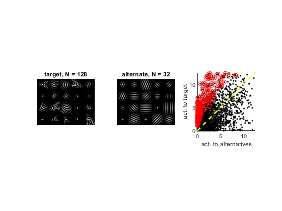
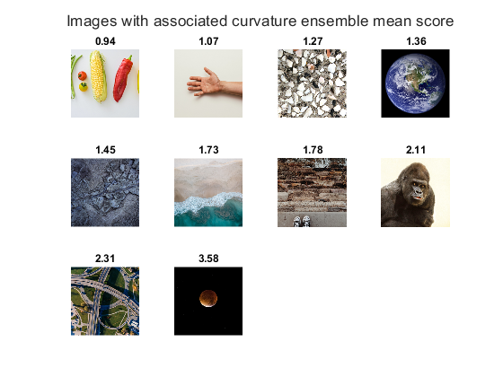

# License


Please cite the following publication when using or adapting this software or substantial portion thereof for work resulting a publication:


Rose O., Johnson J.K., Wang B. and Ponce C.R.; As simple as possible, but not simpler: features of the neural code for object recognition; JOURNAL TBA


(also see the CITATION file)


  


MIT License


Copyright (c) 2021 PonceLab


Permission is hereby granted, free of charge, to any person obtaining a copy of this software and associated documentation files (the "Software"), to deal in the Software without restriction, including without limitation the rights to use, copy, modify, merge, publish, distribute, sublicense, and/or sell copies of the Software, and to permit persons to whom the Software is furnished to do so, subject to the following conditions:


The above copyright notice and this permission notice shall be included in all copies or substantial portions of the Software.


THE SOFTWARE IS PROVIDED "AS IS", WITHOUT WARRANTY OF ANY KIND, EXPRESS OR IMPLIED, INCLUDING BUT NOT LIMITED TO THE WARRANTIES OF MERCHANTABILITY, FITNESS FOR A PARTICULAR PURPOSE AND NONINFRINGEMENT. IN NO EVENT SHALL THE AUTHORS OR COPYRIGHT HOLDERS BE LIABLE FOR ANY CLAIM, DAMAGES OR OTHER LIABILITY, WHETHER IN AN ACTION OF CONTRACT, TORT OR OTHERWISE, ARISING FROM, OUT OF OR IN CONNECTION WITH THE SOFTWARE OR THE USE OR OTHER DEALINGS IN THE SOFTWARE.


```matlab:Code
% add the necessary files to the path (this should be all that is required)
addpath(genpath(pwd))
addpath(genpath(fullfile(fileparts(pwd),'data')))
addpath(genpath(fullfile(fileparts(pwd),'utils')))
```

# Semantic ensemble analysis


Investigators often have specific visual concepts they want to operationalize, but sometimes one lacks the specific image-generation tools to do this. Here we leveraged convolutional neural networks to represent visual concepts that can be described semantically (e.g., "curvature," "faces"). The tactic is to use two image data stores that represent a contrast - for example, using images containing curved lines and images containing straight lines to capture the concept of "curvature", or using images containing monkey faces and images containing monkey bodies to capture the concept of "faces." By propagating each pair of image sets into a neural network, one can identify collections of hidden units that respond to the target category more than to the alternative category. These units represent a "semantic ensemble" that can be used to test separate image sets. 


  


This approach was inspired by the practice of fMRI-analysis localizer techniques, where one selects voxels using one dataset, testing the selected voxels with separately collected data sets. 


# Creating the ensemble


In this section, we declare the neural network and layer in which to identify the hidden units that will form the ensemble.


```matlab:Code
net = alexnet; % readily available in Matlab. Calling it for the first time will prompt a way to download it from Mathworks.
net_name = 'alexnet';
layers_all = {'relu1', 'relu2','relu3','relu4','relu5','relu6','relu7','fc8'} ;
iLayer = 6 ; 
t_layer = layers_all{iLayer} ;

% semantic hypothesis
myP_threshold = 0.0001; % threshold for selecting each unit

% Load images representing the target hypothesis and a useful contrast (alternative)
path2Target = '..\data\curved_gabors' ;
path2Alternative  = '..\data\straight_gabors' ;
dsTarget = imageDatastore(path2Target);
dsAlternative =  imageDatastore(path2Alternative);

% conduct an experiment to identify ensembles
[ens_units,mean_Target,mean_Alternative,auTarget,auAlternative] = identifyEnsemble(dsTarget,dsAlternative,net,t_layer,myP_threshold);

imgsT = read(auTarget);
imgsP = read(auAlternative) ;

figure
tiledlayout(1,3);
rng(2)
npics = size(imgsT,1);
if npics > 20, areShown = randsample(npics,20); else, areShown = 1:npics; end
tmp_pics = table2array(imgsT);
nexttile; montage(tmp_pics(areShown)) ; title(sprintf('target, N = %d',npics));

npics = size(imgsP,1);
if npics > 20, areShown = randsample(npics,20); else, areShown = 1:npics; end
tmp_pics2 =table2array(imgsP);
nexttile; montage(tmp_pics2(areShown)) ; title(sprintf('alternate, N = %d',npics));

nexttile
plot(mean_Alternative,mean_Target,'k.');
hold on
plot(mean_Alternative(ens_units),mean_Target(ens_units),'ro');
axis tight square
box off

prctile_values = prctile([mean_Alternative,mean_Target],[0.01 99]);
h = fig_diag(prctile_values(1),prctile_values(2)); set(h,'color','y');
axis([prctile_values(1),prctile_values(2),prctile_values(1),prctile_values(2)]);
ylabel('act. to target');
xlabel('act. to alternatives');
```




# Scoring image with the ensemble.


Now you can input the separately collected input images and quantify the activations of the semantic ensemble (in red) to every test image.


```matlab:Code
testImStack = [] ;
myDS = imageDatastore('..\data\natural-image-examples');
pics = readall(myDS);
meanEnsScores=zeros(1,length(pics));
for iPic = 1:length(pics)
    tPic = pics{iPic};
    pic_size = size(tPic);

    win1 = centerCropWindow2d(pic_size,[min(size(tPic,1:2)) min(size(tPic,1:2))]);
    img = imcrop(tPic,win1);
    img = imresize(img,net.Layers(1).InputSize(1:2)) ;
    testImStack = cat(4,testImStack,img);
    meanEnsScores(iPic)=mean(ensembleScore(img,net,t_layer,ens_units));
end % of iPic

figMain = figure ;
% show every image sorted by its ratio
[~,iSort] = sort( meanEnsScores ,'ascend','MissingPlacement','last') ;
for iShow = 1:length(pics)
    tInd = iSort(iShow) ;
    figure(figMain)
    nexttile
    imagesc(testImStack(:,:,:,tInd ) );
    axis image off; colorbar off; box off;
    title(sprintf('%1.2f',meanEnsScores( tInd ) ) );
    sgtitle('Images with associated curvature ensemble mean score')
end
```





```matlab:Code

```

# Functions

```matlab:Code
function [ens_units,mean_Target,mean_Alternative,auTarget,auAlternative] = identifyEnsemble(dsTarget,dsAlternative,net,t_layer,myP_threshold)

auTarget = augmentedImageDatastore(net.Layers(1).InputSize,dsTarget,...
    'ColorPreprocessing','gray2rgb') ;
auAlternative = augmentedImageDatastore(net.Layers(1).InputSize,dsAlternative,...
    'ColorPreprocessing','gray2rgb') ;

% compute activations
act_Target = activations(net,auTarget,t_layer,'OutputAs','channels');
act_Alternative = activations(net,auAlternative,t_layer,'OutputAs','channels');

auTarget.reset;
auAlternative.reset;

% if using a convolutional layer, this code would have to be modified.
act_Target1 = squeeze(act_Target)';
act_Alternative1 = squeeze(act_Alternative)';

p_values = nan(size(act_Target1,2),1);
for iUnit = 1:size(act_Target1,2)
    p_values(iUnit) = ranksum(act_Target1(:,iUnit), act_Alternative1(:,iUnit),'tail','right' ) ; % right x > left
end

mean_Target = mean(act_Target1,1) ;
mean_Alternative = mean(act_Alternative1,1) ;

ens_units = find( p_values < myP_threshold & mean_Target' > 1 ) ;
end

function [ensembleScores] = ensembleScore(im2Score,net,t_layer,ens_units)

allActs = activations(net,im2Score,t_layer,'OutputAs','channels');

% if using a convolutional layer, this code would have to be modified.
allActs = squeeze(allActs)';
allActs = mean(allActs,1) ;

ensembleScores=allActs(ens_units);
end
```

